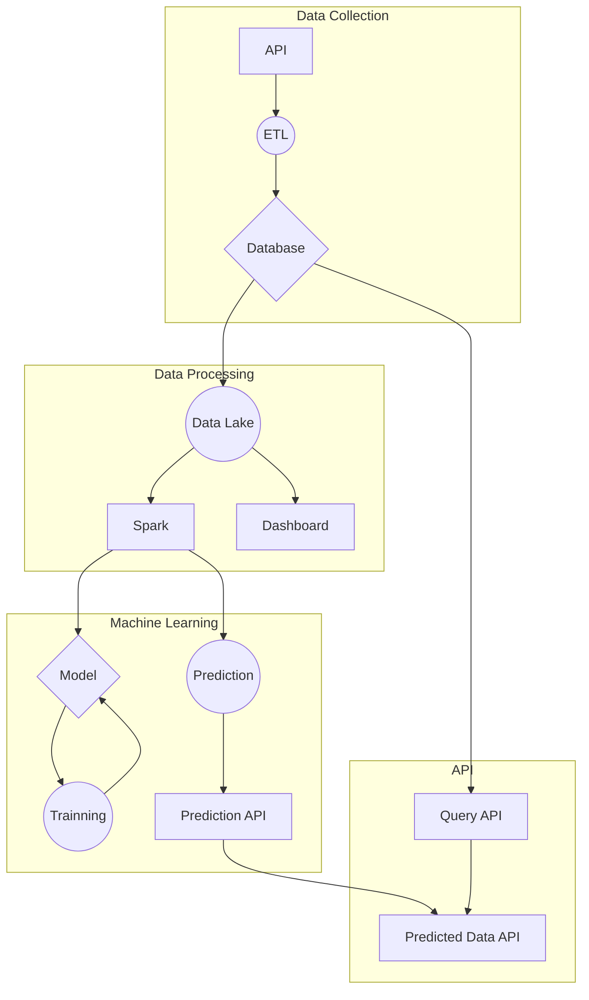

# WeatherPrediction

## Architeture Diagram


## Repository Structure

```
weather_prediction/
    ├── api/
    │   ├── app.py
    │   ├── requirements.txt
    │   └── ...
    ├── notebooks/
    │   ├── data_exploration.ipynb
    │   ├── data_preprocessing.ipynb
    │   ├── model_training.ipynb
    │   └── ...
    ├── src/
    │   ├── data/
    │   │   ├── data.py
    │   │   └── ...
    │   ├── models/
    │   │   ├── lstm.py
    │   │   └── ...
    │   └── ...
    ├── streamlit/
    │   ├── app.py
    │   ├── requirements.txt
    │   └── ...
    ├── tests/
    │   ├── test_data.py
    │   ├── test_models.py
    │   └── ...
    ├── .gitignore
    ├── LICENSE
    ├── README.md
    ├── requirements.txt
    └── ...
```
